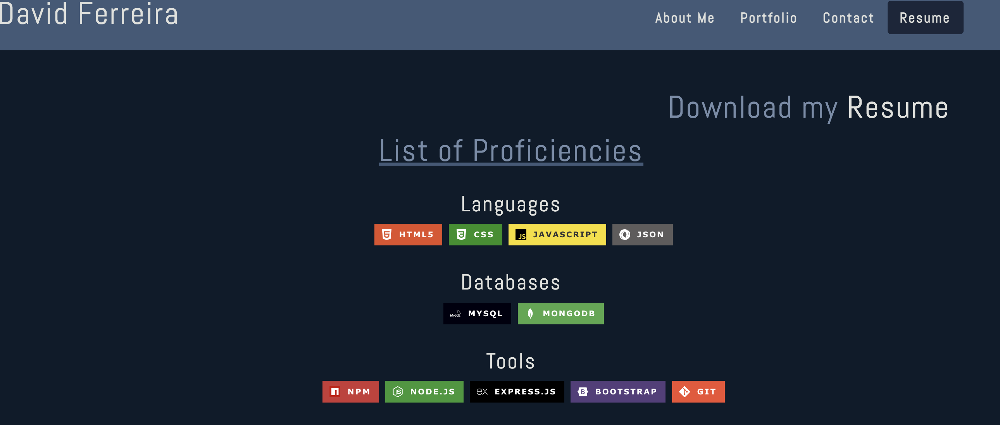
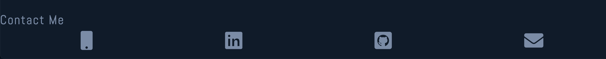

# David Ferreira's Portfolio

## Description

My portfolio show cases some of my projects and group projects! Get a glance of my work by viewing the deployed applications and take a look at my code via github. If you like what you see, please feel free to contact me! I am always looking to connect!

**Check out my <a href="https://disantoz.github.io/dferreira/" target="_blank">Portfolio!</a>**

## Table of Contents

- [Usage](#usage)
- [Technology](#technology)
- [Questions](#questions)
- [License](#license)

## Usage

Naviate through the different tabs on the top of the page to jump to the different sections of my website !

Each tab in the nav will highlight to show which content you're currently viewing.

The Portfolio tab will display my projects, which includes a `short description`, `tools used`, and `links` to the `Github repo` as well as the `deployed website`!

The `Contact` tab will allow the user to asks me questions, or leave a message.

Navigating to the `Resume` tab, will display a list of my proficiencies, broken down by categories. On the top left you can click on the word `Resume` to download and view/save my resume!

Finally, at the footer, you can view my `LinkedIn` and `GitHub` as well as `email`.

## Technology

- React
- Bootstrap
- Font-awesome

## Questions

Hi my name is [DiSantoz](https://github.com/DiSantoz) if you like my work and want to connect feel free to contact me at: dferreira91@outlook.com!

You can also reach me through the other contact methods listed in the portfolio.

## License

MIT License

Copyright (c) 2021 DiSantoz

Permission is hereby granted, free of charge, to any person obtaining a copy
of this software and associated documentation files (the "Software"), to deal
in the Software without restriction, including without limitation the rights
to use, copy, modify, merge, publish, distribute, sublicense, and/or sell
copies of the Software, and to permit persons to whom the Software is
furnished to do so, subject to the following conditions:

The above copyright notice and this permission notice shall be included in all
copies or substantial portions of the Software.

THE SOFTWARE IS PROVIDED "AS IS", WITHOUT WARRANTY OF ANY KIND, EXPRESS OR
IMPLIED, INCLUDING BUT NOT LIMITED TO THE WARRANTIES OF MERCHANTABILITY,
FITNESS FOR A PARTICULAR PURPOSE AND NONINFRINGEMENT. IN NO EVENT SHALL THE
AUTHORS OR COPYRIGHT HOLDERS BE LIABLE FOR ANY CLAIM, DAMAGES OR OTHER
LIABILITY, WHETHER IN AN ACTION OF CONTRACT, TORT OR OTHERWISE, ARISING FROM,
OUT OF OR IN CONNECTION WITH THE SOFTWARE OR THE USE OR OTHER DEALINGS IN THE
SOFTWARE.
